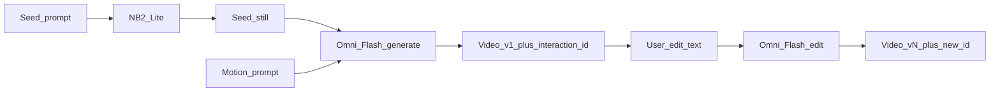

# Conversational Video Architecture (generic)

## Goal

Prove **multi-turn video direction**: seed fast stills, animate, then edit the *same* clip through natural language — not a one-shot prompt box.

## Models (locked)

| Step | Model | API surface |
| --- | --- | --- |
| Seed still | `gemini-3.1-flash-lite-image` | `models.generateContent` |
| Generate video | `gemini-omni-flash-preview` | `interactions.create` |
| Edit video | `gemini-omni-flash-preview` (same) | `interactions.create` + `previous_interaction_id` |

### Text vs audio for edits

- **Use text** as the primary edit channel (challenge-ready, API-supported).
- Optional **reference images** on edit turns for element swaps.
- **Do not depend on audio input** — Omni Flash preview does not support uploading audio references on the Gemini API yet (model can still *output* video with sound).

## Pipeline



## Key files

- `lib/orchestrator.ts` — `runSeed` / `runGenerate` / `runEdit`
- `lib/gemini.ts` — SDK wrappers
- `lib/session.ts` — demo session + turn log (holds `latestInteractionId`)
- `lib/theme.ts` — **only** place to rebrand to AI Kitchen later

## API contracts

### `POST /api/seed`
```json
{ "prompt": "...", "aspectRatio": "16:9", "sessionId": "optional" }
```
→ `{ sessionId, image: { mimeType, data }, latencyMs, model }`

### `POST /api/video`
```json
{ "prompt": "...", "sessionId": "...", "aspectRatio": "16:9", "images": [] }
```
If `images` omitted, uses session seed when present.  
→ `{ sessionId, video, interactionId, latencyMs, model }`

### `POST /api/edit`
```json
{
  "instruction": "Swap the background to dusk",
  "previousInteractionId": "v1_...",
  "sessionId": "..."
}
```
→ `{ sessionId, video, interactionId, latencyMs, model }`

## Limits to design around

- ~10s video generations (preview)
- Stack up conversational edits (Google notes ~3 sequential edits in demos; keep UX honest)
- Large base64 payloads — keep maxDuration high on video/edit routes
- In-memory sessions reset on server restart

## Later: AI Kitchen

1. Change `productTheme` copy/prompts in `theme.ts`
2. Optionally add kitchen-specific starter assets under `public/`
3. Keep the same seed → animate → edit loop
